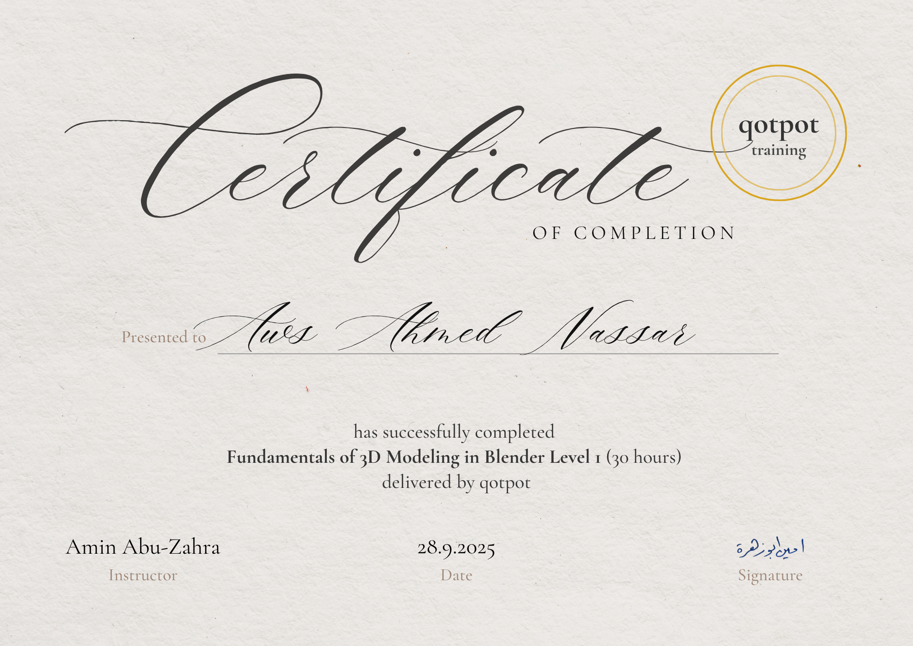

# Blender Fundamentals

Welcome to the **Blender Fundamentals** repository! This repository contains essential learning materials and resources for mastering the basics of Blender, the powerful open-source 3D creation suite.

## 📚 About This Course

This course is designed to provide a comprehensive introduction to Blender's core functionality. Whether you're new to 3D modeling or transitioning from other software, these fundamentals will establish a strong foundation for all your future Blender projects.

This course is instructed by **Amin Abu-Zahra**, an experienced 3D artist and educator.  
You can explore more about his work and learning resources via his [Linktree](https://linktr.ee/aminabuzahra).  
The course is proudly provided by **Qotpot**.

## 🎓 What You'll Learn

### Core Blender Fundamentals
- ✅ Blender Interface Navigation  
- ✅ 3D Viewport Essentials  
- ✅ Object Manipulation  
- ✅ Modeling Basics  
- ✅ Materials and Shading  
- ✅ Lighting Techniques  
- ✅ Camera Operations  
- ✅ Rendering Basics  

## 📂 Classwork

Supplemental materials, practice files, texture packs, and reference documents can be found in the [Classwork](./Classwork) folder.

## 🎓 Certification

Happy Blending! 🎨  

*This curriculum is developed by the Blender Education Foundation.*
